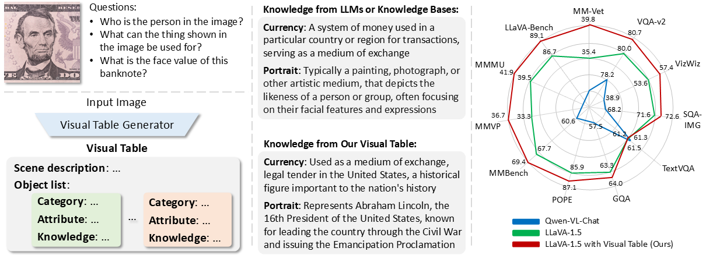
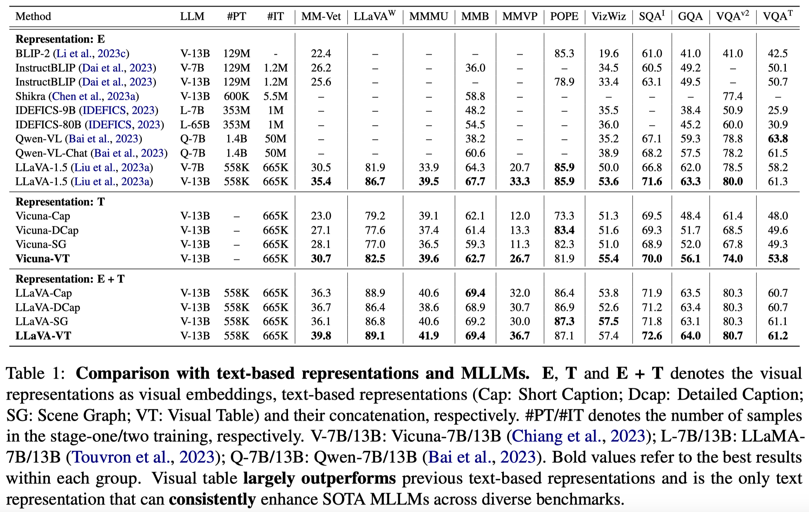

# Visual Table

This is the official PyTorch implementation of Visual Table (EMNLP 2024).

> **Beyond Embeddings: The Promise of Visual Table in Multi-Modal Models** [[Paper](https://github.com/YiwuZhong/Visual-Table)] <br>
> [Yiwu Zhong](https://scholar.google.com/citations?user=irrbH_IAAAAJ&hl=en)<sup>\*1,2</sup>, [Zi-Yuan Hu](https://henryhzy.github.io/)<sup>\*1,2</sup>, [Michael R. Lyu](https://www.cse.cuhk.edu.hk/lyu/home)<sup>1</sup>, [Liwei Wang](https://lwwangcse.github.io/)<sup>#1</sup> <br>
> <sup>1</sup>The Chinese University of Hong Kong, <sup>2</sup>Shanghai AI Laboratory <br>
> (<sup>\*</sup> equal contributions, <sup>#</sup> corresponding author) <br>

<p align="center">

</p>


## Overview

Visual representation learning has been a cornerstone in computer vision, involving typical forms such as visual embeddings, structural symbols, and text-based representations. Despite the success of CLIP-type visual embeddings, they often lack access to world knowledge critical for visual reasoning. In this work, we propose **Visual Table**, a novel form of visual representation tailored for general visual reasoning.
- Visual tables are constructed as **hierarchical descriptions** of visual scenes, featuring *a scene description* and multiple descriptions covering *categories*, *attributes*, and *knowledge* for individual object instances. 
- Thanks to the structural and textual formats, visual tables offer **unique properties** over mere visual embeddings, such as *explainability* and *controllable editing*. Furthermore, they deliver *instance-level world knowledge* and *detailed attributes* that are essential for visual reasoning.
- To create visual tables, we design prompts for GPT4V to produce annotations on 61K images. We then develop a generator trained on these annotations. The **annotations** and the **trained generator** are released to the public.
- Extensive results on **11 visual reasoning benchmarks** demonstrate that the generated visual tables *significantly* outperform previous structural and text-based representations. Moreover, they *consistently* enhance state-of-the-art multimodal large language models across diverse benchmarks, showcasing their potential for advancing visual reasoning tasks.


## Updates
- [10/7] 🔥 Visual Table is now released! You can download the visual table annotations from [Huggingface](https://huggingface.co/datasets/HenryHZY/Data_Visual_Table) and pre-trained visual table generator from [Huggingface](https://huggingface.co/HenryHZY/VTGenerator-13B). More details can be found below.


## Install

Note: For more details about the environment installation, please refer to [LLaVA](https://github.com/haotian-liu/LLaVA/tree/9a26bd1435b4ac42c282757f2c16d34226575e96).

1. Clone this repository and navigate to Visual-Table folder
```bash
git clone https://github.com/LaVi-Lab/Visual-Table
cd Visual-Table
```

2. Install Package
```Shell
conda create -n vt python=3.10 -y
conda activate vt
pip install --upgrade pip  # enable PEP 660 support
pip install -e .
```

3. Install additional packages for training cases
```
pip install -e ".[train]"
pip install flash-attn --no-build-isolation
```

## Data & Weight Preparation

1. Download `data_VT.zip` from [Huggingface](https://huggingface.co/datasets/HenryHZY/Data_Visual_Table) or [Google Drive](https://drive.google.com/file/d/1VKV4fs-j2B0lEx8h7VcU_zDGypztWD6N/view?usp=sharing). 

    Notes: 
    1. Unzip `data_VT.zip` to `./playground/data_VT`. This zip file contains all materials required for training & evaluating visual table generator & our multi-modal LLMs. The visual table annotations have been converted into the instruction tuning samples for training the generator.
    2. If you would like to use visual table annotations only, you can just download the file `visual_table_annotations.json`. This file include 61K visual table annotations collected from GPT4V, as well as a few visual tables from other datasets for ablation purposes (e.g., GQA, MM-Vet, MMMU, MMVP). The annotation scripts can be found in `preprocess/collect_gpt4v_VT/gpt4v.py`.
    
    The following is the file structure for your convenience:
    <details>
    <summary>Click for more details... </summary>

    ```
    ./playground/data_VT
    ├── eval
    │   ├── gqa
    │   │   ├── answers
    │   │   │   └── gqa_with_VTGenerator-13B_gen_vt
    │   │   │       └── LLaVA-VT-13B
    │   │   │           ├── merge.jsonl
    │   │   │           └── testdev_balanced_predictions.json
    │   │   ├── data
    │   │   └── gqa_with_VTGenerator-13B_gen_vt.jsonl
    │   ├── llava-bench-in-the-wild
    │   │   ├── answers
    │   │   │   └── llavabench_with_VTGenerator-13B_gen_vt
    │   │   │       └── LLaVA-VT-13B
    │   │   │           └── LLaVA-VT-13B.jsonl
    │   │   ├── llavabench_with_VTGenerator-13B_gen_vt.jsonl
    │   │   └── reviews
    │   │       └── llavabench_with_VTGenerator-13B_gen_vt
    │   │           └── LLaVA-VT-13B
    │   │               └── LLaVA-VT-13B_gpt-3.5-turbo-1106.jsonl
    │   ├── mmbench
    │   │   ├── answers
    │   │   │   └── mmbench_with_VTGenerator-13B_gen_vt
    │   │   │       └── LLaVA-VT-13B
    │   │   │           └── LLaVA-VT-13B.jsonl
    │   │   └── answers_upload
    │   │       └── mmbench_with_VTGenerator-13B_gen_vt
    │   │           └── LLaVA-VT-13B
    │   │               └── LLaVA-VT-13B.xlsx
    │   ├── mmmu
    │   │   ├── answers
    │   │   │   └── mmmu_with_VTGenerator-13B_gen_vt
    │   │   │       └── LLaVA-VT-13B
    │   │   │           ├── gpt_eval_gpt-3.5-turbo-1106
    │   │   │           └── mmmu_with_VTGenerator-13B_gen_vt_LLaVA-VT-13B.jsonl
    │   │   ├── mmmu.jsonl
    │   │   └── mmmu_with_VTGenerator-13B_gen_vt.jsonl
    │   ├── mm-vet
    │   │   ├── mmvet_with_VTGenerator-13B_gen_vt
    │   │   │   ├── answers
    │   │   │   │   └── LLaVA-VT-13B
    │   │   │   │       └── mmvet_with_VTGenerator-13B_gen_vt_LLaVA-VT-13B.jsonl
    │   │   │   └── results
    │   │   │       └── LLaVA-VT-13B
    │   │   │           ├── mmvet_with_VTGenerator-13B_gen_vt_LLaVA-VT-13B_gpt-4-32k-0613-cap-int-score-1runs.csv
    │   │   │           ├── mmvet_with_VTGenerator-13B_gen_vt_LLaVA-VT-13B_gpt-4-32k-0613-cap-score-1runs.csv
    │   │   │           ├── mmvet_with_VTGenerator-13B_gen_vt_LLaVA-VT-13B_gpt-4-32k-0613-grade-1runs.json
    │   │   │           └── mmvet_with_VTGenerator-13B_gen_vt_LLaVA-VT-13B.json
    │   │   └── mmvet_with_VTGenerator-13B_gen_vt.jsonl
    │   ├── mmvp_mc
    │   │   ├── answers
    │   │   │   └── mmvp_mc_with_VTGenerator-13B_gen_vt
    │   │   │       └── LLaVA-VT-13B
    │   │   │           └── mmvp_mc_with_VTGenerator-13B_gen_vt_LLaVA-VT-13B.jsonl
    │   │   ├── mmvp_mc.jsonl
    │   │   └── mmvp_mc_with_VTGenerator-13B_gen_vt.jsonl
    │   ├── pope
    │   │   ├── answers
    │   │   │   └── pope_with_VTGenerator-13B_gen_vt
    │   │   │       └── LLaVA-VT-13B
    │   │   │           └── merge.jsonl
    │   │   ├── pope_coco_commitID_e3e39262c85a6a83f26cf5094022a782cb0df58d
    │   │   │   ├── coco_pope_adversarial.json
    │   │   │   ├── coco_pope_popular.json
    │   │   │   └── coco_pope_random.json
    │   │   └── pope_with_VTGenerator-13B_gen_vt.jsonl
    │   ├── scienceqa
    │   │   ├── answers
    │   │   │   └── scienceqa_with_VTGenerator-13B_gen_vt
    │   │   │       └── LLaVA-VT-13B
    │   │   │           ├── LLaVA-VT-13B.jsonl
    │   │   │           ├── LLaVA-VT-13B_output.jsonl
    │   │   │           └── LLaVA-VT-13B_result.json
    │   │   └── scienceqa_with_VTGenerator-13B_gen_vt.json
    │   ├── textvqa
    │   │   ├── answers
    │   │   │   └── textvqa_with_VTGenerator-13B_gen_vt
    │   │   │       └── LLaVA-VT-13B
    │   │   │           └── merge.jsonl
    │   │   └── textvqa_with_VTGenerator-13B_gen_vt.jsonl
    │   ├── vizwiz
    │   │   ├── answers
    │   │   │   └── vizwiz_with_VTGenerator-13B_gen_vt
    │   │   │       └── LLaVA-VT-13B
    │   │   │           └── merge.jsonl
    │   │   ├── answers_upload
    │   │   │   └── vizwiz_with_VTGenerator-13B_gen_vt
    │   │   │       └── LLaVA-VT-13B
    │   │   │           └── LLaVA-VT-13B.json
    │   │   └── vizwiz_with_VTGenerator-13B_gen_vt.jsonl
    │   └── vqav2
    │       ├── answers_upload
    │       │   └── vqav2_dev_with_VTGenerator-13B_gen_vt
    │       │       └── LLaVA-VT-13B.json
    │       └── vqav2_dev_with_VTGenerator-13B_gen_vt.jsonl
    ├── eval_images_gen_vt
    │   ├── gqa_gen_vt
    │   │   └── VTGenerator-13B
    │   │       └── merge.jsonl
    │   ├── gqa_gen_vt.jsonl
    │   ├── llavabench_gen_vt
    │   │   └── VTGenerator-13B
    │   │       └── merge.jsonl
    │   ├── llavabench_gen_vt.jsonl
    │   ├── mmbench_gen_vt
    │   │   └── VTGenerator-13B
    │   │       └── merge.jsonl
    │   ├── mmbench_gen_vt.jsonl
    │   ├── mmmu_gen_vt
    │   │   └── VTGenerator-13B
    │   │       └── merge.jsonl
    │   ├── mmmu_gen_vt.jsonl
    │   ├── mmvet_gen_vt
    │   │   └── VTGenerator-13B
    │   │       └── merge.jsonl
    │   ├── mmvet_gen_vt.jsonl
    │   ├── mmvp_gen_vt
    │   │   └── VTGenerator-13B
    │   │       └── merge.jsonl
    │   ├── mmvp_gen_vt.jsonl
    │   ├── pope_gen_vt
    │   │   └── VTGenerator-13B
    │   │       └── merge.jsonl
    │   ├── pope_gen_vt.jsonl
    │   ├── scienceqa_gen_vt
    │   │   └── VTGenerator-13B
    │   │       └── merge.jsonl
    │   ├── scienceqa_gen_vt.jsonl
    │   ├── textvqa_gen_vt
    │   │   └── VTGenerator-13B
    │   │       └── merge.jsonl
    │   ├── textvqa_gen_vt.jsonl
    │   ├── vizwiz_gen_vt
    │   │   └── VTGenerator-13B
    │   │       └── merge.jsonl
    │   ├── vizwiz_gen_vt.jsonl
    │   ├── vqav2_gen_vt
    │   │   └── VTGenerator-13B
    │   │       └── merge.jsonl
    │   └── vqav2_gen_vt.jsonl
    ├── gpt_eval
    │   ├── gqa
    │   │   ├── gqa.jsonl
    │   │   └── gqa_with_gpt4v_vt.jsonl
    │   ├── mmmu
    │   │   ├── mmmu.jsonl
    │   │   └── mmmu_with_gpt4v_vt.jsonl
    │   ├── mmvet
    │   │   ├── mmvet.jsonl
    │   │   └── mmvet_with_gpt4v_vt.jsonl
    │   └── mmvp
    │       ├── mmvp.jsonl
    │       └── mmvp_with_gpt4v_vt.jsonl
    ├── README.md
    ├── train_images_gen_vt
    │   ├── llava_instruct_mix665k_coco_gen_vt.jsonl
    │   ├── llava_instruct_mix665k_ocrvqa_gen_vt.jsonl
    │   ├── llava_instruct_mix665k_textcap_gen_vt.jsonl
    │   ├── llava_instruct_mix665k_vg_gen_vt.jsonl
    │   └── VTGenerator-13B_VT_292k.json
    ├── train_LLaVA-VT
    │   └── llava_instruct_mix665k_with_VT.json
    └── train_VTGenerator
        ├── finetune_VTGenerator_gpt4v_VT_61k.json
        └── pretrain_VTGenerator_llava_instruct_mix199k.json
    ```
    </details>

2. Following [LLaVA](https://github.com/haotian-liu/LLaVA/tree/9a26bd1435b4ac42c282757f2c16d34226575e96), download the data for visual instruction tuning.

    The following is the file structure for your convenience:
    <details>
    <summary>Click for more details... </summary>

    ```
    ./playground/data
    ├── coco
    │   └── train2017
    ├── gqa
    │   └── images
    ├── ocr_vqa
    │   └── images
    ├── textvqa
    │   └── train_images
    └── vg
        ├── VG_100K
        └── VG_100K_2
    ```
    </details>

3. Following [LLaVA/docs/Evaluation.md](https://github.com/haotian-liu/LLaVA/blob/9a26bd1435b4ac42c282757f2c16d34226575e96/docs/Evaluation.md), download the data and `eval.zip` for evaluation.

    For MMMU and MMVP, download the data from their official repos.

4. Download the pretrained model weights:

    Note: you have to modify the path to these pretrained model weights on the training scripts.

    | Pretrained Model Weight                      | Download Link                                                |
    | -------------------------- | ------------------------------------------------------------ |
    | lmsys/vicuna-13b-v1.5                           | [Huggingface](https://huggingface.co/lmsys/vicuna-13b-v1.5) |
    | openai/clip-vit-large-patch14-336                           | [Huggingface](https://huggingface.co/openai/clip-vit-large-patch14-336) |
    | liuhaotian/llava-v1.5-mlp2x-336px-pretrain-vicuna-13b-v1.5 | [Huggingface](https://huggingface.co/liuhaotian/llava-v1.5-mlp2x-336px-pretrain-vicuna-13b-v1.5) |

## VTGenerator

After collecting the visual table annotations, we train a VTGenerator to produce visual tables for the input images. Specifically, the training includes pre-training and fine-tuning stage, as described as follows (more details can be found in paper Sec. 3.2). Once trained, VTGenerator can be used to generate visual tables for downstream tasks such as VQA.

### VTGenerator Training

For quick usage, we have provided the checkpoints of our VTGenerator as follows:

| Model                      | Download Link                                                |
| -------------------------- | ------------------------------------------------------------ |
| VTGenerator-13B (Preferred)                          | [Huggingface](https://huggingface.co/HenryHZY/VTGenerator-13B) |
| VTGenerator-7B                           | [Huggingface](https://huggingface.co/HenryHZY/VTGenerator-7B) |

If you want to reproduce the training of VTGenerator, you can follow the following scripts:

#### Pretraining stage:

Details are provided in `./scripts/VTGenerator/train/pretrain_VTGenerator-Pretrained-13B.sh`.
```
mkdir -p scripts/log/VTGenerator

CUDA_VISIBLE_DEVICES=0,1,2,3,4,5,6,7 bash scripts/VTGenerator/train/finetune_VTGenerator-13B.sh 2>&1 | tee -a scripts/log/VTGenerator/finetune_VTGenerator-13B.txt
```

#### Fine-tuning stage:

Details are provided in `./scripts/VTGenerator/train/finetune_VTGenerator-13B.sh`.
```
CUDA_VISIBLE_DEVICES=0,1,2,3,4,5,6,7 bash scripts/VTGenerator/train/finetune_VTGenerator-13B.sh 2>&1 | tee -a scripts/log/VTGenerator/finetune_VTGenerator-13B.txt
```

### VTGenerator Inference (Visual Table Generation)

We have provided the visual table generation results of `VTGenerator-13B` in `data_VT.zip`:

```
Visual tables for training images: 
    ./playground/data_VT/train_images_gen_vt

Visual tables for evaluation images: 
    ./playground/data_VT/eval_images_gen_vt
```

If you want to reproduce the inference of VTGenerator, you can follow the following scripts:

#### For images used in downstream task training:

Details are provided in `./scripts/VTGenerator/infer/train_images_gen_vt.sh`.
```
# infer VTGenerator-13B on llava_instruct_mix665k
CUDA_VISIBLE_DEVICES=0,1,2,3,4,5,6,7 bash scripts/VTGenerator/infer/train_images_gen_vt/llava_instruct_mix665k_coco_gen_vt.sh VTGenerator-13B
CUDA_VISIBLE_DEVICES=0,1,2,3,4,5,6,7 bash scripts/VTGenerator/infer/train_images_gen_vt/llava_instruct_mix665k_ocrvqa_gen_vt.sh VTGenerator-13B
CUDA_VISIBLE_DEVICES=0,1,2,3,4,5,6,7 bash scripts/VTGenerator/infer/train_images_gen_vt/llava_instruct_mix665k_textcap_gen_vt.sh VTGenerator-13B
CUDA_VISIBLE_DEVICES=0,1,2,3,4,5,6,7 bash scripts/VTGenerator/infer/train_images_gen_vt/llava_instruct_mix665k_vg_gen_vt.sh VTGenerator-13B 

# merge the inference results & store VTGenerator-13B_VT_292k.json & store llava_instruct_mix665k_with_VT.json
python ./scripts/VTGenerator/infer/train_images_gen_vt/merge_llava_instruct_mix665k_all_gen_vt.py \
    --gen_VT_path './playground/data_VT/train_images_gen_vt/VTGenerator-13B_VT_292k.json' \
    --llava_instruct_mix665k_path '/path/to/liuhaotian/LLaVA-Instruct-150K/llava_v1_5_mix665k.json' \
    --image_path './playground/data' \
    --llava_instruct_mix665k_with_VT './playground/data_VT/train_LLaVA-VT/llava_instruct_mix665k_with_VT.json' 
```

#### For images used in downstream task evaluation:

Details are provided in `./scripts/VTGenerator/infer/eval_images_gen_vt.sh`.
```
CUDA_VISIBLE_DEVICES=0,1,2,3,4,5,6,7 bash scripts/VTGenerator/infer/eval_images_gen_vt.sh VTGenerator-13B
```

## LLaVA-VT

We choose image reasoning task as the testbed of our generated visual tables, such as the benchmarks of multi-modal LLMs (MLLMs). Below, we provide the scripts for training a MLLM using visual tables as inputs, as well as the scripts for its evaluation. We refer this VQA model as LLaVA-VT in the following descriptions.

### LLaVA-VT Training

For quick usage, we have provided the checkpoints of our LLaVA-VT as follows:

| Model                      | Download Link                                                |
| -------------------------- | ------------------------------------------------------------ |
| LLaVA-VT-13B (Preferred) | [Huggingface](https://huggingface.co/HenryHZY/LLaVA-VT-13B) |
| LLaVA-VT-7B                           | [Huggingface](https://huggingface.co/HenryHZY/LLaVA-VT-7B) |

If you want to reproduce the training of LLaVA-VT, you can follow the following scripts:

Details are provided in `./scripts/LLaVA-VT/train/finetune_LLaVA-VT-13B.sh`.
```
# mkdir -p scripts/log/LLaVA-VT
# CUDA_VISIBLE_DEVICES=0,1,2,3,4,5,6,7 bash scripts/LLaVA-VT/train/finetune_LLaVA-VT-13B.sh 2>&1 | tee -a scripts/log/LLaVA-VT/finetune_LLaVA-VT-13B.txt
```

### LLaVA-VT Evaluation

<p align="center">

</p>

Notes: Before running the evaluation scripts, please:

1. download the evaluation data and `eval.zip` (following [LLaVA/docs/Evaluation.md](https://github.com/haotian-liu/LLaVA/blob/9a26bd1435b4ac42c282757f2c16d34226575e96/docs/Evaluation.md)).

2. utilize the provided visual tables for each dataset from `./playground/data_VT/eval_images_gen_vt`, or utilize `./scripts/VTGenerator/infer/eval_images_gen_vt.sh` to generate the visual tables for each evaluation dataset.

3. GPT-assisted evaluation is applied for mmvet, llavabench, and mmmu. More details are provided in the corresponding evaluation scripts. Please also refer to our paper: `4.1 Comparison Experiments. Setup.`

Details of the evaluation scripts  (Table 1 in the main paper) are provided in `./scripts/LLaVA-VT/eval/eval_multi_datasets_with_VT.sh`.

```
VTGenerator="VTGenerator-13B"
Model="LLaVA-VT-13B"

mkdir -p scripts/log/eval_multi_datasets_with_VT
```

<details>
<summary>Click for more details... </summary>

#### Evaluation on mmvet with visual table:
```
CUDA_VISIBLE_DEVICES=0 bash scripts/LLaVA-VT/eval/mmvet/mmvet.sh ${VTGenerator} ${Model} 2>&1 | tee -a scripts/log/eval_multi_datasets_with_VT/mmvet_with_${VTGenerator}_gen_vt_${Model}.txt
```

#### Evaluation on llavabench with visual table:
```
CUDA_VISIBLE_DEVICES=0 bash scripts/LLaVA-VT/eval/llavabench/llavabench.sh ${VTGenerator} ${Model} 2>&1 | tee -a scripts/log/eval_multi_datasets_with_VT/llavabench_with_${VTGenerator}_gen_vt_${Model}.txt
```

#### Evaluation on mmmu with visual table:
```
CUDA_VISIBLE_DEVICES=0 bash scripts/LLaVA-VT/eval/mmmu/mmmu.sh ${VTGenerator} ${Model} 2>&1 | tee -a scripts/log/eval_multi_datasets_with_VT/mmmu_with_${VTGenerator}_gen_vt_${Model}.txt
```

#### Evaluation on mmbench with visual table:
```
CUDA_VISIBLE_DEVICES=0 bash scripts/LLaVA-VT/eval/mmbench/mmbench.sh ${VTGenerator} ${Model} 2>&1 | tee -a scripts/log/eval_multi_datasets_with_VT/mmbench_with_${VTGenerator}_gen_vt_${Model}.txt
```

#### Evaluation on mmvp with visual table:
```
CUDA_VISIBLE_DEVICES=0 bash scripts/LLaVA-VT/eval/mmvp_mc/mmvp_mc.sh ${VTGenerator} ${Model} 2>&1 | tee -a scripts/log/eval_multi_datasets_with_VT/mmvp_mc_with_${VTGenerator}_gen_vt_${Model}.txt
```

#### Evaluation on pope with visual table:
```
CUDA_VISIBLE_DEVICES=0,1,2,3,4,5,6,7 bash scripts/LLaVA-VT/eval/pope/pope.sh ${VTGenerator} ${Model} 2>&1 | tee -a scripts/log/eval_multi_datasets_with_VT/pope_with_${VTGenerator}_gen_vt_${Model}.txt
```

#### Evaluation on vizwiz with visual table:
```
CUDA_VISIBLE_DEVICES=0,1,2,3,4,5,6,7 bash scripts/LLaVA-VT/eval/vizwiz/vizwiz.sh ${VTGenerator} ${Model} 2>&1 | tee -a scripts/log/eval_multi_datasets_with_VT/vizwiz_with_${VTGenerator}_gen_vt_${Model}.txt
```

#### Evaluation on scienceqa with visual table:
```
CUDA_VISIBLE_DEVICES=0 bash scripts/LLaVA-VT/eval/scienceqa/scienceqa.sh ${VTGenerator} ${Model} 2>&1 | tee -a scripts/log/eval_multi_datasets_with_VT/scienceqa_with_${VTGenerator}_gen_vt_${Model}.txt
```

#### Evaluation on gqa with visual table:
```
CUDA_VISIBLE_DEVICES=0,1,2,3,4,5,6,7 bash scripts/LLaVA-VT/eval/gqa/gqa.sh ${VTGenerator} ${Model} 2>&1 | tee -a scripts/log/eval_multi_datasets_with_VT/gqa_full_with_${VTGenerator}_gen_vt_${Model}.txt
```

#### Evaluation on vqav2 with visual table:
```
CUDA_VISIBLE_DEVICES=0,1,2,3,4,5,6,7 bash scripts/LLaVA-VT/eval/vqav2/vqav2_dev.sh ${VTGenerator} ${Model} 2>&1 | tee -a scripts/log/eval_multi_datasets_with_VT/vqav2_dev_with_${VTGenerator}_gen_vt_${Model}.txt
```

#### Evaluation on textvqa with visual table:
```
CUDA_VISIBLE_DEVICES=0,1,2,3,4,5,6,7 bash scripts/LLaVA-VT/eval/textvqa/textvqa.sh ${VTGenerator} ${Model} 2>&1 | tee -a scripts/log/eval_multi_datasets_with_VT/textvqa_with_${VTGenerator}_gen_vt_${Model}.txt
```
</details>

## Citation

If you find this repo useful, please consider citing our paper:
```bibtex

@article{zhong2024beyond,
  title={Beyond Embeddings: The Promise of Visual Table in Multi-Modal Models},
  author={Zhong, Yiwu and Hu, Zi-Yuan and Lyu, Michael R and Wang, Liwei},
  journal={arXiv preprint arXiv:2403.18252},
  year={2024}
}
```

## Acknowledgement

- [LLaVA](https://github.com/haotian-liu/LLaVA/tree/9a26bd1435b4ac42c282757f2c16d34226575e96): the codebase we build upon.