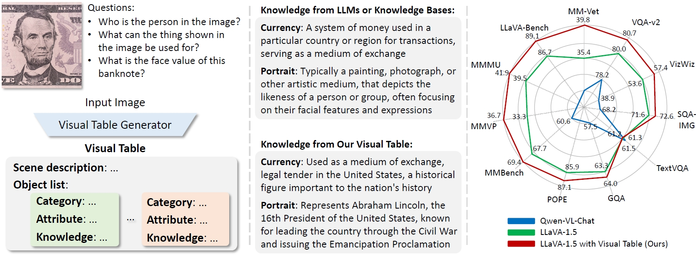

# Visual Table

> **Beyond Embeddings: The Promise of Visual Table in Multi-Modal Models** [[Paper](https://github.com/YiwuZhong/Visual-Table)]  
> [Yiwu Zhong](https://scholar.google.com/citations?user=irrbH_IAAAAJ&hl=en)\*1, [Ziyuan Hu](https://henryhzy.github.io/)\*1,2, [Michael R. Lyu](https://www.cse.cuhk.edu.hk/lyu/home)1, [Liwei Wang](https://lwwangcse.github.io/)#1  
> 1The Chinese University of Hong Kong, 2Shanghai AI Laboratory  
> (\* equal contributions, # corresponding author)  

Stay tuned!
